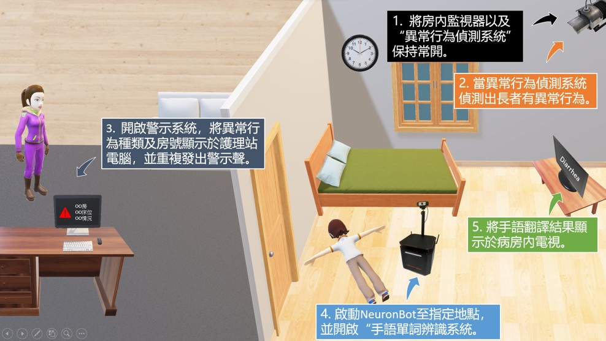
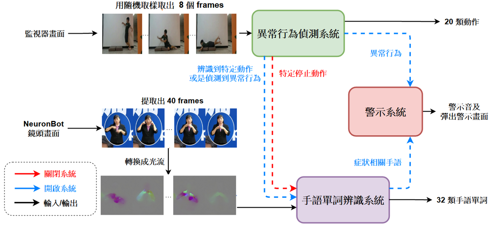
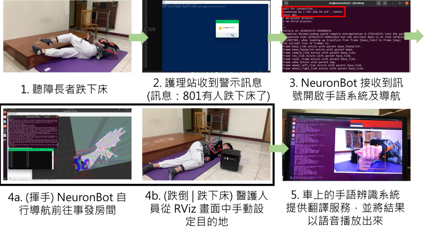

# 手語辨識照護機器人
**Sign Language Recognition Care Robot**

中原大學 資訊工程學系 · 111 學年度專題 · 指導教授：朱守禮 副教授

---

## DEMO

---

## 作品概述

針對台灣長照機構中聽障長者的溝通困境，開發一套整合型照護輔助機器人系統。
系統結合台灣醫療手語辨識、異常行為偵測與緊急示警三大功能，並搭配
ROS NeuronBot 自主導航，在聽障長者發生緊急狀況時自動派遣機器人前往協助
即時翻譯手語，縮短因語言隔閡造成的處理延誤。

團隊自行建立台灣首個醫療情境手語資料集（32 類、逾 6,000 支影片）。

---

## 系統架構

| 子系統 | 模型 | 準確率 |
|--------|------|--------|
| 手語單詞辨識 | I3D CNN + Optical Flow | 85.6% |
| 異常行為偵測 | MobileNetV2 + LSTM | 90.9% |
| 自主導航 | ROS Navigation Stack + LiDAR SLAM | ±2 cm 建圖精度 |

---

## 實作方式

### 資料集
- **手語單詞**：分析 600 餘支 CDC 記者會直播擷取症狀相關片段，並補充多人、
  多角度自行拍攝，建立 32 類台灣醫療手語資料集（逾 6,000 支），涵蓋約 10 位
  手語教師及 2 位 65 歲以上聽障長者。
  影片規格 600×480、30fps，切割比例訓練：驗證：測試 = 30:6:1。
- **異常行為**：依長照急症處理指南選出 20 類異常動作，9 類採用 KARD 公開資料集，
  11 類自行拍攝，切割比例 8:2:1。

### 模型架構
- **手語辨識**：每支影片提取 40 frames 轉換為光流圖後輸入 I3D CNN。
  I3D 以 Inception-v1 為基礎擴充三維卷積核，結合 Kinetics & ImageNet 預訓練權重，
  同時捕捉空間與時序特徵，輸出辨識 32 類手語單詞。
- **異常行為偵測**：TSN 稀疏採樣取 8 frames，MobileNetV2 提取空間特徵接 LSTM
  捕捉時序，再通過三層 Dense 及兩層 Dropout 輸出 20 類動作分類。

### 訓練設定
- **手語辨識**：Adam (lr=0.001) 訓練分類層 3 epochs → 解凍全部參數
  lr=0.0001 訓練 27 epochs，合計 50 epochs。RTX 3060 12G / Ubuntu 18.04。
- **異常行為偵測**：SGD 優化器訓練 387 epochs。
  類別數從 15 擴增至 20 後準確率由 88.5% 提升至 90.9%。

### ROS 自主導航
- **硬體**：Adlink NeuronBot，i5-7500T / 16GB RAM，Ubuntu 20.04 + ROS 1
- **建圖**：LiDAR SLAM 建構機構二維地圖，精度 ±2 cm
- **導航**：Navigation Stack（Global Planner + DWA Local Planner）計算最佳路徑，
  動態障礙物可即時繞行
- **TF 座標樹**：`map → odom → base_link → laser_frame / camera_link`
- **事件聯動**：異常行為觸發後透過 Socket 傳送房號至 NeuronBot，
  啟動導航同時開啟車載手語辨識，辨識結果語音播放並顯示於病房電視

---

### 訓練環境
- Ubuntu 18.04
- Python 3.7
- TensorFlow 2.x
- OpenCV
- GPU: NVIDIA RTX 3060 12G

---

## Demo

系統整合流程：
1. 監視器偵測到長者跌下床 → 觸發警示系統
2. 護理站電腦收到房號與異常種類通知並語音播報
3. NeuronBot 透過 Socket 接收房號，啟動自主導航
4. 依照情況導航至病房
5. 抵達後開啟車載手語辨識，辨識結果語音輸出並顯示於電視

---

## 團隊

| 姓名 | 學號 |
|------|------|
| 林庭 | 10827233 |
| 彭桂綺 | 10827234 |
| 邱鈺茹 | 10827242 |

指導教授：朱守禮 副教授

---

## 參考文獻

- Carreira, J., & Zisserman, A. (2017). Quo Vadis, Action Recognition? CVPR.
- Wang, L. et al. (2018). Temporal Segment Networks. IEEE TPAMI.
- Sandler, M. et al. (2018). MobileNetV2. CVPR.
- ROS Navigation Stack — http://wiki.ros.org/navigation
- KARD Dataset — https://data.mendeley.com/datasets/k28dtm7tr6/1
